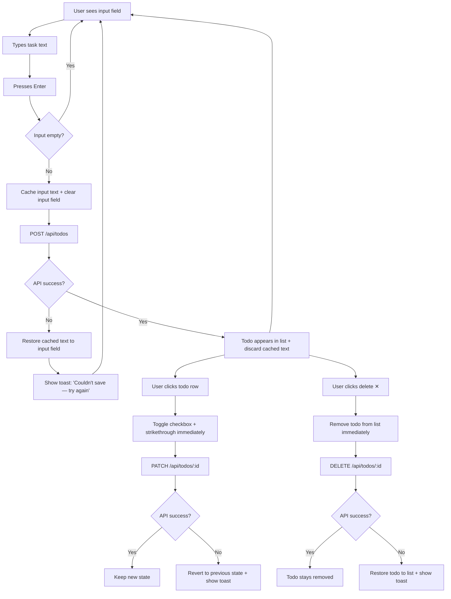
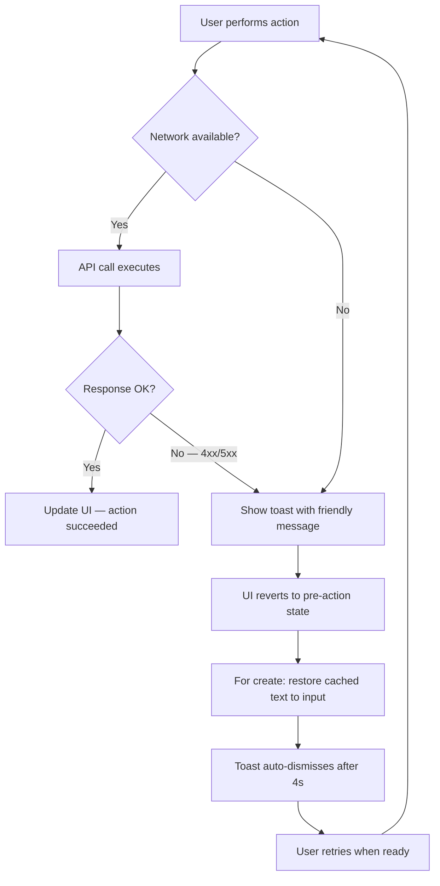
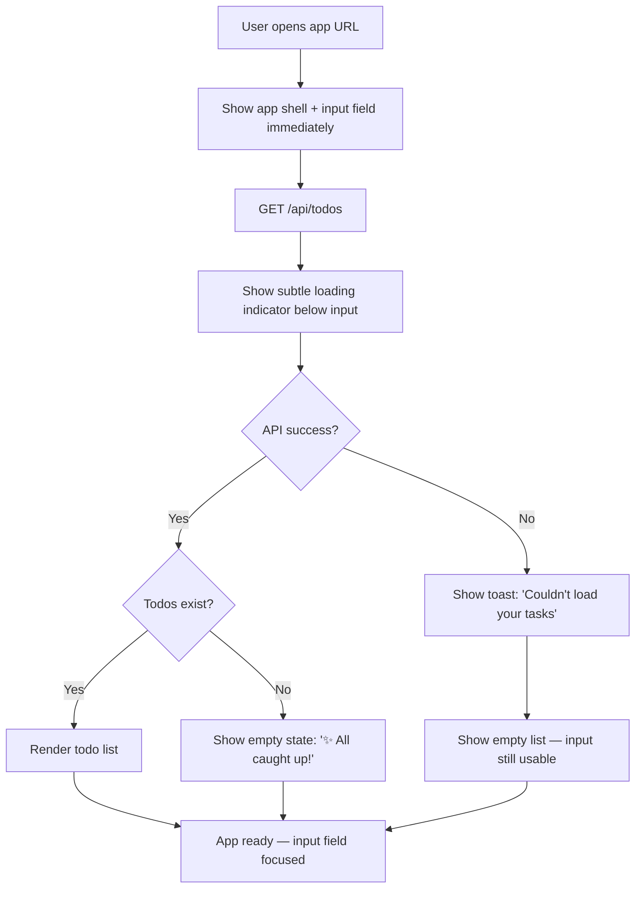

# UX Design Specification todo-app-bmad

**Author:** Bilal
**Date:** April 21, 2026

---

## Executive Summary

### Project Vision

A deliberately minimal todo application that proves focused execution beats feature bloat. The UX strategy is radical simplicity — zero onboarding, instant feedback, and an interface that gets out of the user's way. Every design decision serves one principle: the tool should create less friction than the tasks it manages.

### Target Users

Busy professionals who manage dozens of small daily tasks and are frustrated by productivity tools that demand more attention than the work itself. They are moderately tech-savvy, switch between desktop and mobile throughout the day, and value speed and reliability over customization. They don't want to learn a system — they want to use one.

### Key Design Challenges

1. **Intentional minimalism vs. empty feel** — With a deliberately small feature set, every element must justify its presence. The interface must communicate "this is all you need" rather than "this is all we built."

2. **Speed perception vs. data integrity** — Users expect instant interaction feedback, but the system must never display a todo that hasn't been successfully persisted. The UX must resolve this tension without visible compromise.

3. **Non-disruptive error handling** — Error notifications must be clear enough to prevent false assumptions about saved data, yet lightweight enough to preserve the frictionless experience.

### Design Opportunities

1. **Empty state as accomplishment** — Transform the zero-task state from an edge case into a rewarding moment, reinforcing the app's role as a tool that helps users get things done.

2. **Completion micro-delight** — The todo completion toggle is the most frequent interaction and the core satisfaction moment. Thoughtful visual feedback here creates a habit-reinforcing reward loop.

3. **Trust through transparency** — Honest, clear communication about success and failure states builds user confidence that no task will silently disappear — a trust advantage over more complex tools.

## Core User Experience

### Defining Experience

The core experience is the **add-and-see loop**: type a task, press enter, see it appear instantly in the list. This atomic interaction is the product's entire value proposition in a single gesture. If this moment feels effortless and immediate, the app succeeds. Everything else — completion, deletion, error handling — supports and extends this foundational loop.

The app must feel like an extension of the user's thought process. The gap between "I need to remember something" and "it's captured" should be as close to zero as possible.

### Platform Strategy

- **Platform:** Web SPA, accessed via browser on any device
- **Primary input:** Keyboard-first on desktop, touch-first on mobile
- **Responsive range:** 320px (mobile) to 1920px+ (desktop)
- **No native apps:** Single responsive web app serves all devices
- **No offline support:** Requires active network connection (MVP)
- **Same URL, same data:** Device-agnostic experience with persistent backend storage

### Effortless Interactions

- **Task creation:** Single-field input + enter key. No modals, no submit buttons, no extra fields. The input is always visible and ready.
- **Task completion:** Single tap/click on checkbox. Immediate visual state change with satisfying feedback.
- **Task deletion:** Single action, no confirmation dialog. Low-stakes data in a low-ceremony app.
- **App load:** The todo list appears as if it was always there. Loading state is brief and unobtrusive.

### Critical Success Moments

1. **First task created** — The user adds a todo without any setup or instruction. The reaction: "Oh, that's it?" This is where the app earns its keep against bloated alternatives.
2. **Task completed** — The checkbox toggle produces a visually satisfying transition. This is the most frequent interaction and the primary source of micro-delight.
3. **Return visit** — The user reopens the app and their todos are all there. Trust is established silently — the app just works.
4. **Error handled honestly** — A failed save produces a clear, non-technical toast message. The user knows exactly what happened and what to do. No data is lost silently.

### Experience Principles

1. **Zero-barrier entry** — No friction between intent and action. No signup, no onboarding, no configuration. The app is useful within seconds of opening it.
2. **Instant causality** — Every user action produces an immediate, visible result. Type and enter → todo appears. Tap checkbox → visual completion. Delete → gone. No ambiguity about what happened.
3. **Honest by default** — The app never lies about state. If something saved, it shows. If it failed, it says so clearly. Users never have to wonder.
4. **Less is the feature** — Every element earns its place. Absence of complexity is the product's competitive advantage, not a limitation to apologize for.

## Desired Emotional Response

### Primary Emotional Goals

- **Relief** — The first emotion. The app's lack of friction is itself the value proposition. Users should feel unburdened the moment they open it — no signup, no tour, no decisions to make before they can act.
- **Confidence** — Every interaction confirms that the app did what the user expected. Tasks appear instantly, completions register immediately, errors are communicated clearly. The user never wonders "did that work?"
- **Satisfaction** — Completing a task should feel like a small win. The visual feedback transforms a mundane action into a moment of progress. This micro-reward sustains the habit loop.

### Emotional Journey Mapping

| Stage | Desired Emotion | Design Implication |
|---|---|---|
| First open | Relief — "No signup? I can just start?" | No barriers, input field immediately visible and inviting |
| First task added | Confidence — "That was instant" | Immediate list update, no spinner or delay |
| Task completed | Satisfaction — a small earned reward | Satisfying visual transition (strikethrough, fade, subtle animation) |
| Error encountered | Reassurance — "It told me, I can fix this" | Clear, friendly toast with actionable guidance |
| Return visit | Familiarity — "Everything's where I left it" | Consistent layout, fast load, no re-onboarding |
| All tasks done | Accomplishment — "All caught up" | Friendly empty state that celebrates completion |

### Micro-Emotions

**Cultivate:**
- **Trust** over skepticism — honest state management, no false persistence
- **Accomplishment** over frustration — completion feels rewarding, not just functional
- **Calm** over anxiety — no notification pressure, no overdue badges, no judgment

**Actively avoid:**
- **Overwhelm** — too many choices or visual noise
- **Doubt** — uncertainty about whether an action succeeded
- **Guilt** — no shame mechanics, no streaks, no "you haven't checked in" nudges
- **Confusion** — nothing should require a second thought or explanation

### Design Implications

- **Relief → Minimal chrome:** Strip away everything that isn't the input field and the todo list. White space is a feature.
- **Confidence → Instant feedback:** Every action produces a visible result within 100ms. No ambiguous loading states.
- **Satisfaction → Completion animation:** The checkbox interaction deserves design attention disproportionate to its complexity — this is the primary reward moment.
- **Reassurance → Warm error tone:** Toast messages should be conversational and helpful, not technical or alarming. "Couldn't save — check your connection" not "Error 500: Internal Server Error."
- **Calm → No pressure mechanics:** No due dates in MVP, no notification counts, no red badges. The app waits patiently.

### Emotional Design Principles

1. **The absence of friction is the first delight** — Users don't need to be wowed by features. The relief of something that just works *is* the emotional hook.
2. **Reward the real action, not the app usage** — Celebrate task completion, not engagement metrics. The app succeeds when the user closes it having done what they came to do.
3. **Errors are conversations, not alarms** — When something goes wrong, the tone should be a calm colleague saying "heads up" — not a system screaming failure.
4. **Never make the user feel behind** — No overdue indicators, no shame, no "you have X incomplete tasks" pressure. The list is a tool, not a scorecard.

## UX Pattern Analysis & Inspiration

### Inspiring Products Analysis

**Clear — Minimalism as Delight**
Clear proved that a todo app with almost no features can feel premium through interaction design alone. Its swipe gestures and color-coded heat map made task management feel physical and satisfying. The key insight: when you strip away everything else, the quality of each remaining interaction is magnified. Clear's limitation — gesture-only UI with no visible affordances — confused new users, a mistake we'll avoid by keeping interactions discoverable.

**Google Keep — Trust Through Reliability**
Keep's defining UX quality is invisible: instant auto-save with zero data loss. Users never think about persistence because it simply works. The app loads fast, syncs across devices, and has built a reputation for never losing content. Keep proves that reliability is itself an emotional experience — users don't love it for how it looks, but for how it *behaves*. Its visual weakness — utilitarian card layout that becomes cluttered at scale — reinforces our decision to keep the interface clean and list-based.

**Todoist — The Quick-Add Gold Standard (and Feature Bloat Warning)**
Todoist's quick-add interaction is best-in-class: fast keyboard access, natural language parsing, instant capture. Their task completion animation — a satisfying checkmark with a brief celebratory moment — is the gold standard for micro-delight in productivity apps. However, Todoist is also the embodiment of the problem we're solving: projects, labels, priorities, filters, karma scores, and integrations create the very overwhelm that drives users to seek something simpler.

### Transferable UX Patterns

**Interaction Patterns:**
- **Instant persistence (Google Keep)** — Save on action, never require an explicit save step. The user's mental model should be "if I typed it, it's saved."
- **Completion micro-animation (Todoist)** — A brief, satisfying visual moment when a task is marked done. Not flashy, but noticeable enough to feel rewarding.
- **Single-field capture (Clear/Todoist)** — One input, one action, one result. No forms, no modals, no multi-step flows.

**Visual Patterns:**
- **Content-first layout (Clear)** — The todo list IS the interface. No sidebars, no toolbars, no navigation chrome competing for attention.
- **Progressive disclosure (Keep)** — Show only what's needed. Details and actions appear on interaction, not by default.

**Feedback Patterns:**
- **Optimistic-feeling but honest UI** — Show results immediately while ensuring backend persistence. If persistence fails, retract and notify (toast).

### Anti-Patterns to Avoid

- **Hidden gestures without affordances (Clear)** — Every action must be discoverable. No swipe-only or long-press-only interactions. Use visible buttons and checkboxes.
- **Feature creep disguised as "power user tools" (Todoist)** — No labels, no priorities, no projects, no natural language parsing. Our feature ceiling is our feature.
- **Visual clutter through customization (Keep)** — No color-coding, no card layouts, no visual options that create decision fatigue.
- **Gamification and shame mechanics (Todoist karma)** — No streaks, no scores, no "productivity tracking." The app is a tool, not a game.
- **Confirmation dialogs for low-stakes actions** — Deleting a single todo doesn't warrant "Are you sure?" The undo pattern is preferable if needed later.

### Design Inspiration Strategy

**Adopt:**
- Single-field task input with enter-to-submit (Clear/Todoist pattern)
- Completion micro-animation as the primary delight moment (Todoist pattern)
- Auto-persistence with no explicit save action (Keep pattern)
- Content-first layout with minimal chrome (Clear pattern)

**Adapt:**
- Keep's reliability model — applied to our toast-based error feedback system. Same trust outcome, but with explicit communication when things fail rather than silent retry.
- Todoist's quick-add speed — simplified further by removing natural language parsing. Just text in, task out.

**Avoid:**
- Clear's hidden gesture UI — all interactions use visible, standard controls
- Todoist's feature density — our scope is frozen at CRUD
- Keep's visual clutter — no cards, no colors, no grid layouts
- Any gamification, streaks, or engagement metrics

## Design System Foundation

### Design System Choice

**Tailwind CSS** — utility-first CSS framework with custom design tokens.

No pre-built component library. All UI components are hand-crafted using Tailwind utilities, giving full visual control with rapid development speed. The result looks intentionally designed, not "framework default."

### Rationale for Selection

1. **Minimal scope, maximum control** — With only ~5 UI elements to build (input field, todo list, checkbox, delete button, toast notification), a component library would be overkill. Tailwind lets us hand-craft each element while still moving fast.
2. **No visual baggage** — Component libraries impose an aesthetic (Material Design, Ant, etc.) that conflicts with our "intentional minimalism" goal. Tailwind provides constraints (spacing scale, color system) without opinions about how components should look.
3. **Tiny production footprint** — Tailwind purges unused styles at build time, producing a CSS bundle measured in kilobytes. This directly supports our NFR5 (bundle < 200KB gzipped) and NFR2 (FCP < 1 second) requirements.
4. **Solo developer velocity** — Utility classes eliminate context-switching between HTML and CSS files. Responsive design is inline (`md:`, `lg:` prefixes), which speeds up the mobile-first workflow.
5. **Built-in design constraints** — Tailwind's default spacing scale, font sizing, and color palette enforce consistency without needing a separate design token system. We'll customize the theme to match our specific aesthetic.

### Implementation Approach

- **Tailwind CSS v3+** with PostCSS integration
- **Custom theme configuration** in `tailwind.config.js` for project-specific colors, fonts, spacing overrides, and animation timing
- **No component library dependencies** — all components built with utility classes
- **Responsive utilities** using Tailwind's mobile-first breakpoint system (`sm:`, `md:`, `lg:`)
- **Dark mode** deferred — not in MVP scope, but Tailwind's `dark:` prefix makes future addition trivial
- **CSS purging** enabled for production builds to minimize bundle size

### Customization Strategy

- **Design tokens via Tailwind config:** Define our color palette, typography scale, spacing rhythm, border radius, shadow, and transition timing in `tailwind.config.js` as the single source of truth
- **Custom utility classes** only where Tailwind's defaults don't cover our needs (e.g., specific animation keyframes for completion micro-delight)
- **Component patterns via `@apply`** sparingly — prefer utility classes in markup for transparency, use `@apply` only for truly repeated patterns (e.g., toast notification base styles)
- **No abstraction layer** — keep styling visible and inline. For a project this small, a separate design system abstraction would be over-engineering

## Defining Interaction

### The Core Loop

**"Type it, hit enter, it's done."**

This is the sentence a user would say to a friend. The entire product lives or dies on the speed and satisfaction of this loop. Every other interaction — completing, deleting, error handling — exists to support and protect this atomic gesture.

### User Mental Model

Users bring the mental model of a **notepad**, not a project management tool. Their thought process is: "I need to write this down before I forget." The app should feel as immediate as jotting something on a sticky note — but with the permanence of digital storage.

The frustration with alternatives (Todoist, Notion, Reminders) is that they've replaced the sticky note with a *form*. Our app replaces the form with a *line*.

Key mental model principles:
- **No modes** — the app is always ready to accept a new task
- **No hierarchy** — tasks are a flat list, not a tree of projects and sub-tasks
- **No metadata burden** — no priority, no due date, no tags. Just text.
- **Notepad permanence** — "if I wrote it down, it's saved"

### Success Criteria

- User adds first todo within 3 seconds of opening the app
- The add-and-see cycle completes in under 300ms (perceived as instant)
- Input field clears and is ready for the next task immediately after submission
- User never wonders "where do I type?" or "how do I add?"
- Zero-instruction usability — any user, any device, first try

### Pattern Analysis

This is 100% **established pattern** — text input + enter to submit is universal across web applications. No user education is needed. The innovation is not in the interaction pattern but in the **ruthless removal of everything else**. The novelty is what's *not* there: no project picker, no priority selector, no due date field, no tags, no "add to list" dropdown.

All interactions use **visible, standard controls**:
- Text input with placeholder text for task creation
- Checkbox for completion toggle
- Visible delete button (icon or text)
- Toast notifications for error feedback

No hidden gestures, no long-press, no swipe actions. Every action is discoverable on sight.

### Experience Mechanics

| Phase | What Happens | What the User Feels |
|---|---|---|
| **Initiation** | Input field is visible and focused (or easily focusable) on load. No clicks needed to start typing. | "I can just start." |
| **Input** | User types task text. Single line, no formatting, no metadata fields. | "This is exactly as simple as thinking it." |
| **Submission** | User presses Enter. Input clears instantly. | "Done. Next thought." |
| **Feedback** | New todo appears in the list immediately. No spinner. | "It's there. I trust it." |
| **Completion** | User taps/clicks checkbox. Visual transition (strikethrough/fade) plays. | "Satisfying. One down." |
| **Deletion** | User clicks delete. Todo disappears from list. No confirmation dialog. | "Gone. No fuss." |
| **Error** | If any operation fails, toast appears with friendly message. No false state shown. | "Okay, I'll try again. At least it told me." |

## Visual Design Foundation

### Color System

**Philosophy:** Clean and neutral with one deliberate accent color. The interface should feel like white space with just enough color to communicate state — not to decorate. The palette is deliberately quiet; blue as the accent communicates trust and reliability.

**Palette:**

| Role | Color | Hex | Usage |
|---|---|---|---|
| Background | White | `#FFFFFF` | Main app background |
| Surface | Warm gray | `#F9FAFB` | Input field background, subtle sections |
| Text — Primary | Near-black | `#111827` | Todo text, headings |
| Text — Secondary | Medium gray | `#6B7280` | Placeholder text, timestamps |
| Text — Completed | Light gray | `#9CA3AF` | Struck-through completed todo text |
| Border | Soft gray | `#E5E7EB` | Input borders, list dividers |
| Primary accent | Soft blue | `#3B82F6` | Focused input border, checkbox fill on completion |
| Success | Muted green | `#10B981` | Completion checkmark animation flash |
| Error | Warm red | `#EF4444` | Error toast background accent |
| Toast background | Dark | `#1F2937` | Toast notification background |

**Tailwind Config Mapping:**
These colors map directly to Tailwind's default palette — `gray-50`, `gray-900`, `gray-500`, `gray-400`, `gray-200`, `blue-500`, `emerald-500`, `red-500`, `gray-800` — minimizing custom theme configuration.

### Typography System

**Typeface:** Inter (Google Fonts) — clean, highly legible at all sizes, designed for screens, neutral enough to feel invisible. The typography should never be the thing users notice.

| Element | Weight | Size | Line Height |
|---|---|---|---|
| App title | 600 (Semi-bold) | 24px / 1.5rem | 1.2 |
| Todo text | 400 (Regular) | 16px / 1rem | 1.5 |
| Completed todo | 400 (Regular) | 16px / 1rem | 1.5 |
| Input placeholder | 400 (Regular) | 16px / 1rem | 1.5 |
| Toast message | 500 (Medium) | 14px / 0.875rem | 1.4 |
| Empty state text | 400 (Regular) | 16px / 1rem | 1.5 |

**Type scale rationale:** Minimal hierarchy. The app has only two real levels — the title and everything else. Todo text, input text, and empty state text are all 16px to maintain a calm, uniform rhythm. Only toasts are slightly smaller to feel secondary.

### Spacing & Layout Foundation

**Base unit:** 4px (Tailwind default)
**Spacing rhythm:** 8px, 12px, 16px, 24px, 32px

**Layout structure:** Single centered column, max-width 640px. Input field on top, todo list below. Nothing else.

```
┌──────────────────────────────┐
│         App Title            │
│                              │
│  ┌────────────────────────┐  │
│  │  What needs to be done?│  │
│  └────────────────────────┘  │
│                              │
│  ☐  Buy groceries        ✕  │
│  ─────────────────────────   │
│  ☑  Reply to Dana's email ✕  │
│  ─────────────────────────   │
│  ☐  Book dentist appt    ✕  │
│                              │
└──────────────────────────────┘
```

**Key dimensions:**
- Max content width: 640px centered
- Input field height: 48px (comfortable touch target)
- Todo item height: ~48px minimum (44px touch target + padding)
- Vertical spacing between todos: 0px (separated by 1px border dividers)
- Container padding: 16px (mobile), 24px (desktop)
- Space above input: 32px
- Space between input and list: 24px

**Layout feel:** Airy, not dense. Each task has room to breathe. The generous max-width prevents line lengths from becoming unwieldy and keeps the interface focused on a single purpose.

### Accessibility Considerations

- **Contrast ratios:** All text passes WCAG AA (4.5:1 minimum). Primary text `#111827` on `#FFFFFF` = 15.4:1. Secondary text `#6B7280` on `#FFFFFF` = 5.0:1.
- **Focus indicators:** Visible blue ring (`ring-2 ring-blue-500`) on all interactive elements during keyboard navigation
- **Touch targets:** Minimum 44x44px on all interactive elements (checkbox, delete button, input field)
- **No color-only communication:** Completed todos use strikethrough text decoration + color change, not color alone
- **Semantic HTML:** Buttons are `<button>`, inputs are `<input>`, lists use `<ul>`/`<li>`, checkboxes use `<input type="checkbox">`
- **Screen reader labels:** All interactive controls have associated accessible labels

## Design Direction Decision

### Design Directions Explored

Six design directions were explored via interactive HTML mockups ([ux-design-directions.html](ux-design-directions.html)):

1. **Clean Minimal** — Rounded input, circle checkboxes, hairline dividers, left-aligned title
2. **Soft Cards** — Card-per-todo, square checkboxes, green completion, hover-reveal delete
3. **Borderless** — Underline input, no dividers, uppercase title, hidden delete
4. **Bold Header** — Dark header with embedded input, white list below
5. **Add Button** — Visible add button alongside input, square checkboxes
6. **Warm & Friendly** — Amber palette, warm tones, personal personality

### Chosen Direction

**Direction 1: Clean Minimal** — with two interaction enhancements:

1. **Full-row click to toggle completion** — The entire todo row is clickable to mark done/not done. The checkbox remains as visual affordance, but users don't need to aim precisely at it. The delete button is excluded from the toggle zone.
2. **Row hover highlight** — On mouse hover, the todo row background shifts subtly (to `#F9FAFB`) with `cursor: pointer`, providing immediate visual feedback that the row is interactive before the user clicks.

### Design Rationale

- **Clean Minimal is the purest expression of our "less is the feature" principle.** No cards, no bold headers, no warm colors competing for attention. Just a white surface with content.
- **Full-row click** increases the effective touch/click target from 20px (checkbox) to the full 48px row height, reducing precision demands and supporting both mobile touch and desktop mouse usage.
- **Row hover highlight** reinforces interactivity, connects to the "instant causality" principle (feedback before action), and serves as visual confirmation that the full row is clickable.
- Combined, these enhancements make the interaction feel more forgiving and confident — directly supporting the "relief" emotional goal.

### Implementation Approach

- **Layout:** Single centered column, max-width 640px, white background
- **Input:** Rounded corners, subtle gray background (`#F9FAFB`), blue focus ring
- **Todo rows:** Full-width clickable area with `cursor: pointer`, hairline bottom borders (`#F3F4F6`)
- **Checkbox:** Circle, 20px, blue fill on completion with checkmark
- **Completed state:** Strikethrough text + color change to `#9CA3AF`
- **Delete button:** Right-aligned `×`, gray by default, red on hover. Uses `stopPropagation` to prevent triggering row toggle.
- **Hover state:** Row background shifts to `#F9FAFB` on desktop; no hover effect on touch devices
- **Transitions:** Subtle 150ms transitions on checkbox fill, hover background, and delete button color

## User Journey Flows

### Task Lifecycle Flow (Create, Complete, Delete)

Covers PRD Journey 1 (First Visit) and Journey 2 (Mobile Usage).



**Key interaction decisions:**
- **Create:** Input clears instantly for speed feel. Text is cached internally. On API failure, cached text is restored to the input field so the user can retry with one Enter press — no retyping.
- **Complete:** Optimistic toggle — checkbox and strikethrough animate immediately. If API fails, state reverts and toast explains.
- **Delete:** Optimistic removal — todo disappears from list immediately. If API fails, todo is restored to its position and toast explains.

### Error Handling Flow

Covers PRD Journey 3 (Sam Hits a Snag).



**Toast message guidelines:**
- Create fail: "Couldn't save your task — check your connection and try again"
- Complete fail: "Couldn't update — check your connection"
- Delete fail: "Couldn't delete — check your connection"
- Load fail: "Couldn't load your tasks — check your connection"
- Tone: conversational, non-technical, actionable

### App Load Flow

Covers PRD Journey 4 (Empty Slate) and initial load state.



**Key load decisions:**
- App shell and input field render immediately — user can start typing before todos finish loading
- Loading indicator is subtle (not a full-screen spinner) — placed below the input, doesn't block interaction
- On load failure, the input field is still usable — the user can add tasks even if existing ones failed to load

### Journey Patterns

**Consistent patterns across all flows:**

1. **Optimistic UI with honest rollback** — Actions reflect immediately in the UI. If the backend fails, state reverts cleanly with a toast explanation. No silent failures, no stuck states.
2. **Input text preservation on failure** — When task creation fails, the user's text is restored to the input field. They never have to retype.
3. **Toast as the single error channel** — All errors surface through the same mechanism: a dark toast with a friendly message that auto-dismisses after 4 seconds. No modals, no inline errors, no red borders.
4. **Always-usable input** — The input field is available in every app state: loading, empty, populated, error. The user can always add a task.

### Flow Optimization Principles

1. **Minimize time-to-action** — The input field is visible and ready before any data loads. The user never waits to start.
2. **Cache user intent** — Never discard user input until the system has confirmed it's saved. Typed text is the user's most valuable asset in the moment.
3. **Fail gracefully, recover instantly** — Every error path returns the user to a working state within one step. No dead ends.
4. **No blocking UI** — Loading indicators and error states never prevent the user from taking action. The app degrades gracefully.

## Component Strategy

### Design System Components

**Tailwind CSS provides the utility foundation, not pre-built components.** All components are custom-built using Tailwind utility classes, with design tokens defined in `tailwind.config.js`. The app requires only 7 components total — a deliberately small inventory that matches the product's minimal scope.

### Custom Components

#### TodoInput

| Property | Specification |
|---|---|
| **Purpose** | Capture new task text — the entry point for the core "type it, hit enter" loop |
| **HTML** | `<input type="text">` with wrapper `<form>` for Enter key submission |
| **States** | Empty (placeholder: "What needs to be done?"), Focused (blue ring `ring-2 ring-blue-500`), Filled (user typing), Submitting (input clears, text cached) |
| **Behavior** | Enter key submits. Input clears immediately on submit. Cached text restores on API failure. Prevents empty submission. |
| **Dimensions** | Height: 48px, full width, rounded corners (`rounded-lg`), background `#F9FAFB`, border `#E5E7EB` |
| **Accessibility** | `aria-label="Add a new task"`, auto-focus on app load, visible focus indicator |

#### TodoItem

| Property | Specification |
|---|---|
| **Purpose** | Display a single todo with completion toggle and delete action |
| **HTML** | `<li>` containing checkbox, text span, and delete button |
| **States** | **Default:** white background, dark text. **Hovered:** background `#F9FAFB`, `cursor: pointer`. **Completed:** checkbox fills blue with checkmark, text `#9CA3AF` with `line-through`. **Deleting:** optimistic removal from DOM. |
| **Behavior** | Full-row click toggles completion. Delete button (`×`) uses `stopPropagation` to prevent toggle. Optimistic state updates with rollback on API failure. |
| **Dimensions** | Min-height: 48px (44px touch target + padding), full width, bottom border `#F3F4F6` |
| **Checkbox** | Circle, 20px diameter, border `#D1D5DB`, checked fill `#3B82F6` with white checkmark |
| **Delete** | `×` button, 32px hit area, color `#D1D5DB` default → `#EF4444` on hover, background `transparent` → `#FEE2E2` on hover |
| **Accessibility** | Checkbox uses `<input type="checkbox">` with label. Delete button has `aria-label="Delete task: {todo text}"`. Row click wired to checkbox toggle. |

#### TodoList

| Property | Specification |
|---|---|
| **Purpose** | Container rendering the ordered list of todos |
| **HTML** | `<ul>` containing TodoItem `<li>` elements |
| **States** | **Loading:** shows LoadingIndicator. **Populated:** renders todo items. **Empty:** shows EmptyState. |
| **Behavior** | Conditionally renders LoadingIndicator, EmptyState, or list of TodoItems based on app state |

#### Toast

| Property | Specification |
|---|---|
| **Purpose** | Display error messages as non-blocking notifications |
| **HTML** | `<div>` positioned fixed, bottom-right |
| **States** | **Hidden:** not in DOM or `display: none`. **Entering:** slide-in from bottom with fade (`0.3s ease`). **Visible:** static display. **Exiting:** fade-out (`0.3s ease`). |
| **Behavior** | Auto-dismisses after 4 seconds. Multiple toasts stack or replace. Dark background `#1F2937`, white text, red accent icon `#EF4444`. |
| **Dimensions** | Max-width: 360px, padding 14px 20px, border-radius 8px |
| **Content** | Icon (⚠️) + message text (14px, medium weight) |
| **Accessibility** | `role="alert"`, `aria-live="polite"` — screen readers announce toast content automatically |

#### EmptyState

| Property | Specification |
|---|---|
| **Purpose** | Friendly message when no todos exist — transforms empty list into accomplishment moment |
| **HTML** | `<div>` with emoji and text |
| **Content** | Emoji: ✨ (40px) + Text: "All caught up! Add a task to get started." (16px, `#9CA3AF`) |
| **Behavior** | Static display, no interaction. Centered within list area. |
| **Dimensions** | Padding: 48px vertical |

#### LoadingIndicator

| Property | Specification |
|---|---|
| **Purpose** | Subtle indication that data is loading on initial app load |
| **HTML** | `<div>` with animated element (pulsing dots or small spinner) |
| **Behavior** | Displayed below input during initial GET /api/todos. Does NOT block the input field — user can type while loading. Disappears when data loads or on error. |
| **Dimensions** | Small — 24px height, centered. Not a full-screen overlay. |

#### AppShell

| Property | Specification |
|---|---|
| **Purpose** | Outer layout container providing centered, responsive structure |
| **HTML** | `<main>` or `<div>` with title `<h1>` |
| **Content** | App title: "Todos" (24px, semi-bold `#111827`) |
| **Dimensions** | Max-width: 640px, centered (`mx-auto`), padding: 16px (mobile) / 24px (desktop), white background, full-height |

### Component Implementation Strategy

- **No component library** — all 7 components built from scratch with Tailwind utilities
- **Design tokens centralized** in `tailwind.config.js` — colors, spacing, border-radius, transition timing
- **Minimal abstraction** — each component is a single file with clear responsibility. No shared component base class, no component factory, no HOC patterns.
- **State management drives rendering** — TodoList conditionally renders Loading, Empty, or Populated states. TodoItem receives props for todo data and callbacks for toggle/delete.
- **Transitions in CSS** — all animations (toast slide-in, checkbox fill, hover background) use CSS transitions (150ms default) rather than JavaScript animation libraries

### Implementation Roadmap

**All components ship in MVP — no phasing needed.** The component count is small enough (7) that all are required for the minimum viable experience:

| Priority | Component | Reason |
|---|---|---|
| 1 | AppShell | Layout foundation — everything else lives inside it |
| 2 | TodoInput | Core loop entry point — must work first |
| 3 | TodoItem | Core interaction — display and toggle todos |
| 4 | TodoList | Container for items — manages state-dependent rendering |
| 5 | Toast | Error handling — required before API integration |
| 6 | EmptyState | Polish — needed for empty list UX |
| 7 | LoadingIndicator | Polish — needed for initial load UX |

## UX Consistency Patterns

### Interaction Feedback Patterns

Every user action gets exactly one of three feedback types — never combined:

| Feedback Type | Trigger | Visual Response | Duration |
|---|---|---|---|
| **Immediate state change** | Create, complete, delete (success) | UI updates inline — new item appears, checkbox fills, item removed | Instant (<100ms) with 150ms CSS transition |
| **Toast notification** | Any API failure | Dark toast slides in from bottom-right with friendly message | 4 seconds, then auto-dismiss |
| **No feedback** | Empty input submit | Nothing happens — silent rejection. No error, no shake, no red border. | — |

**Rule:** Never combine feedback types. Successful actions get inline state changes only — no success toasts ("Task added!"). Errors get a toast only — no inline red borders. One channel per event.

### Form Patterns

The app has one form: the todo input. Its behavior defines the standard:

- **Submit on Enter** — Enter key is the sole submission method. No visible submit button.
- **Empty submit prevention** — Silent. No "field required" error, no red border, no shake. Nothing happens.
- **Placeholder as instruction** — "What needs to be done?" serves as both label and prompt.
- **No validation** — Any non-empty text is valid. No character limits, no format requirements in MVP.
- **Clear on success, restore on failure** — Input clears immediately on submit. Text is cached. If API fails, cached text restores to input field for easy retry.

### State Transition Patterns

| From | To | Transition |
|---|---|---|
| Loading → Populated | Todos appear | List fades in (150ms opacity) |
| Loading → Empty | No todos exist | Empty state fades in (150ms opacity) |
| Loading → Error | API failed | Toast appears, input remains usable |
| Empty → Populated | First todo added | Todo item appears instantly (no animation) |
| Populated → Empty | Last todo deleted | Empty state fades in after item removal |
| Active → Completed | Checkbox toggled | 150ms: checkbox fills blue, text fades to gray, strikethrough slides across |
| Completed → Active | Checkbox untoggled | 150ms: checkbox empties, text color restores, strikethrough removed |
| Item → Deleted | Delete clicked | Item removed instantly — no exit animation (immediate feels more decisive) |

### Error Patterns

All errors follow the same pattern without exception:

- **Channel:** Toast notification only — no inline errors, no modals, no page-level alerts
- **Tone:** Conversational, non-technical — "Couldn't save" not "Error 500"
- **Action guidance:** Always suggest what to do — "check your connection and try again"
- **UI state:** Reverts to pre-action state. No stuck loading, no broken UI.
- **Timing:** Toast appears within 100ms of error detection, auto-dismisses after 4 seconds
- **Stacking:** Newest toast replaces the current one — no toast stacking for this simple app
- **Create errors specifically:** Cached input text restores to the input field alongside the toast

## Responsive Design & Accessibility

### Responsive Strategy

The single-column, max-width 640px layout means "responsive" is primarily a padding and spacing adjustment — no layout reflow, no navigation reorganization, no component hiding.

| Viewport | Adaptations |
|---|---|
| **Mobile (320–767px)** | Container padding: 16px. Input and rows stretch full width. No hover states — touch feedback only. Full-row tap targets for completion toggle. |
| **Desktop (768px+)** | Container padding: 24px. Content centered at max-width 640px. Row hover highlight (`#F9FAFB`) active. `cursor: pointer` on todo rows. Delete button visible on hover (always visible on mobile). |

**What stays the same at all viewports:**
- Single-column layout
- All 7 components rendered identically
- Same interaction patterns (tap/click to toggle, tap/click to delete)
- Same typography scale (no font-size changes across breakpoints)
- Input field always visible at top

**No tablet-specific breakpoint needed.** The mobile layout works well at tablet widths (768px), and the 640px max-width means even landscape iPad shows centered content with natural whitespace.

### Breakpoint Strategy

- **Approach:** Mobile-first using Tailwind's responsive prefixes (`md:` for 768px+)
- **Breakpoints:** Two only — mobile (default) and desktop (`md: 768px`)
- **CSS strategy:** Base styles target mobile. `md:` prefix adds desktop-specific adjustments (padding, hover states)
- **No `sm:`, `lg:`, `xl:` breakpoints needed** — the design is simple enough that two states cover all viewports

**Mobile-specific considerations:**
- Delete button always visible (no hover to reveal on touch devices)
- Touch targets: full row height (48px) for completion toggle, 32px for delete button (within 44px padded area)
- No `:hover` styles on touch — use `@media (hover: hover)` to scope hover effects to pointer devices only

### Accessibility Strategy

**Target: WCAG 2.1 Level AA**

#### Keyboard Navigation

**Tab order** follows the natural DOM reading order, row by row:

1. Input field (auto-focused on app load)
2. Todo 1 checkbox → Todo 1 delete button
3. Todo 2 checkbox → Todo 2 delete button
4. _(continues for each todo item)_

**Keyboard interactions:**
- **Enter** in input field: submit new todo
- **Space** on checkbox: toggle completion (standard checkbox behavior)
- **Enter** on delete button: delete todo
- **Tab/Shift+Tab**: move through interactive elements in row order
- **Escape**: no action (nothing to dismiss in MVP — no modals, no dropdowns)

#### Screen Reader Support

- Input field: `aria-label="Add a new task"`
- Todo list: `<ul>` with `aria-label="Todo list"`
- Checkbox: `<input type="checkbox">` with `<label>` containing todo text — screen reader announces "Buy groceries, checkbox, not checked"
- Delete button: `aria-label="Delete task: Buy groceries"` — dynamic label includes todo text
- Toast: `role="alert"` + `aria-live="polite"` — screen reader announces error messages automatically
- Empty state: Standard text content, no special ARIA needed
- Loading state: `aria-live="polite"` region that announces "Loading tasks" and clears when loaded

#### Color & Contrast

| Element | Foreground | Background | Ratio | Passes AA |
|---|---|---|---|---|
| Primary text | `#111827` | `#FFFFFF` | 15.4:1 | Yes |
| Secondary text | `#6B7280` | `#FFFFFF` | 5.0:1 | Yes |
| Completed text | `#9CA3AF` | `#FFFFFF` | 3.0:1 | Decorative (strikethrough provides redundant cue) |
| Placeholder text | `#6B7280` | `#F9FAFB` | 4.7:1 | Yes |
| Toast text | `#FFFFFF` | `#1F2937` | 14.5:1 | Yes |

**Note:** Completed todo text at 3.0:1 is below AA threshold, but this is acceptable because completion state is communicated redundantly through strikethrough text decoration + filled checkbox — color is not the sole indicator.

#### Focus Management

- **Focus ring:** `ring-2 ring-blue-500 ring-offset-2` on all interactive elements — clearly visible blue outline
- **Auto-focus:** Input field receives focus on app load
- **After adding a todo:** Focus returns to input field (ready for next task)
- **After deleting a todo:** Focus moves to the next todo item's checkbox, or to the input field if the list is now empty
- **Focus trapping:** Not applicable — no modals or overlays in MVP

### Testing Strategy

**Responsive testing:**
- Chrome DevTools device simulation for mobile/tablet viewports
- Physical device testing on iOS Safari and Android Chrome
- Viewport range: 320px to 1920px

**Accessibility testing:**
- Automated: aXe browser extension or Lighthouse accessibility audit
- Keyboard-only: complete all CRUD operations without mouse
- Screen reader: VoiceOver (macOS/iOS) walkthrough of all flows
- Contrast: verify all ratios with browser DevTools or contrast checker tool

### Implementation Guidelines

**Responsive development:**
- Mobile-first CSS: base styles are mobile, use `md:` prefix for desktop adaptations
- Use `@media (hover: hover)` to scope hover effects to pointer devices
- Use relative units (`rem`) for typography and spacing — base 16px
- Test at 320px minimum width to catch overflow issues

**Accessibility development:**
- Semantic HTML first — reach for ARIA only when semantics fall short
- All `` elements (if any) require `alt` attributes
- All form inputs require associated labels (visible or `aria-label`)
- Focus order must match visual order — no `tabindex` values > 0
- Test with keyboard before shipping any interaction
